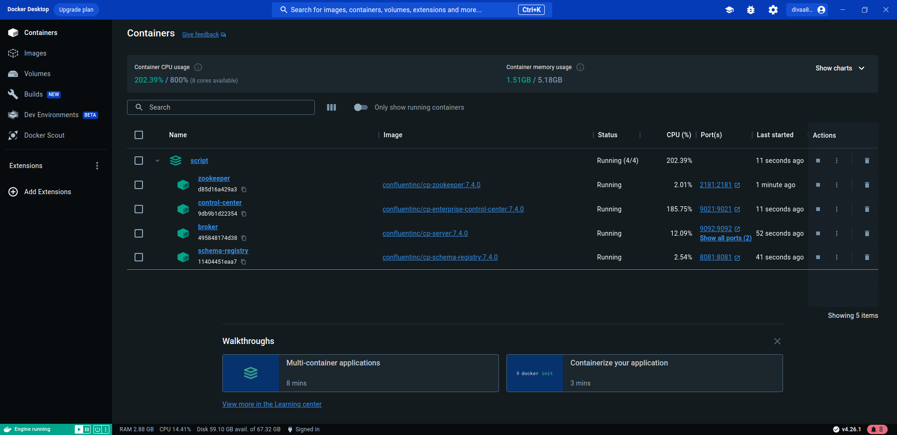
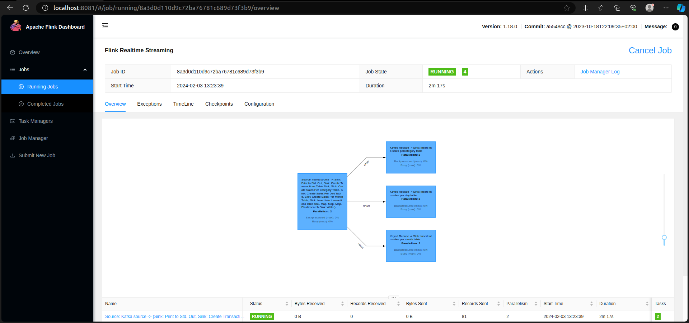
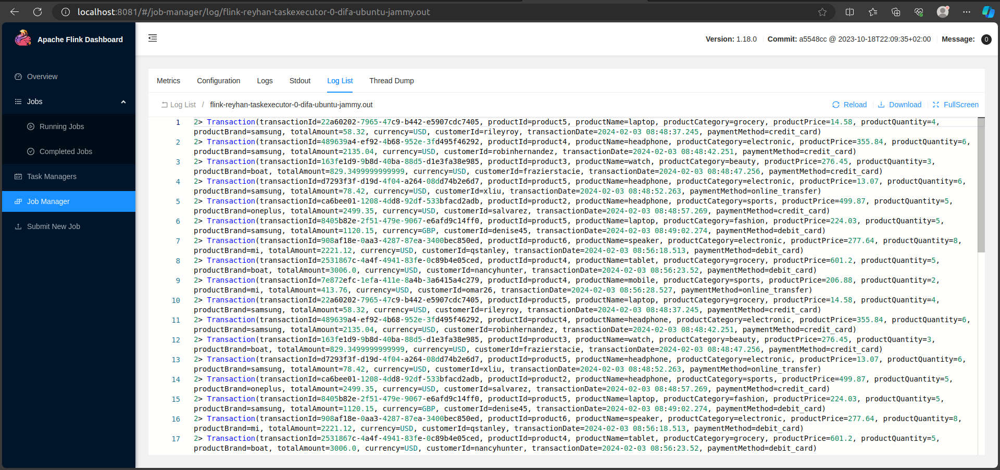
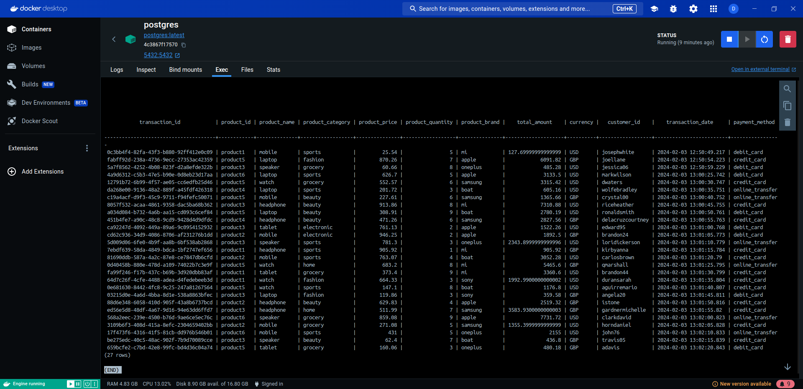
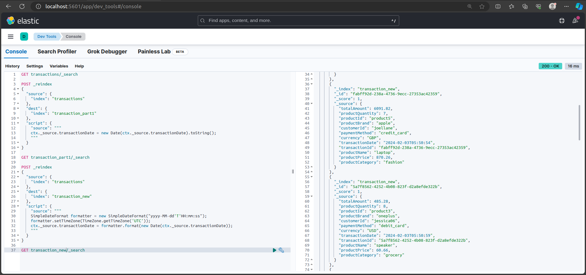
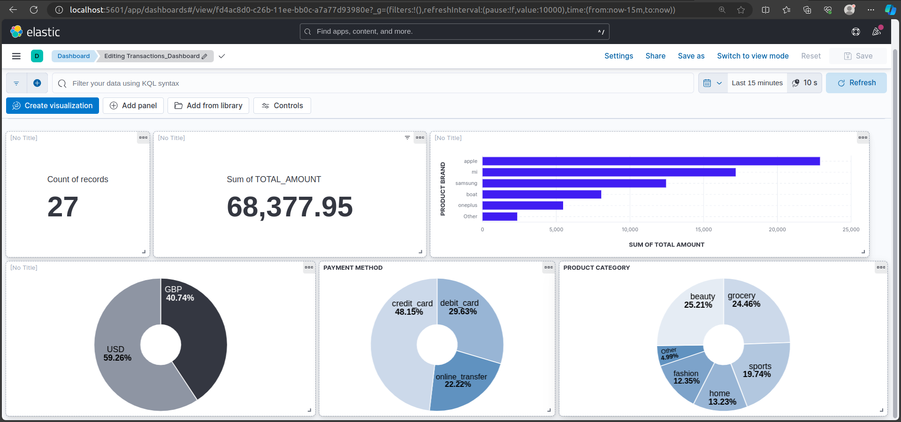

# Real-time Transaction Data Processing System

## Overview
This repository contains the source code and configuration files for a real-time sales data processing system. The system leverages Apache Flink for stream processing, Kafka for data ingestion, PostgreSQL for storing transactional and aggregated data, Elasticsearch for indexing, and Kibana for visualization. The Docker Compose file sets up the entire infrastructure seamlessly.

### Tools
- Container Orchestration: Docker Compose
- Message Broker: Apache Kafka
- Tranformation: Apache Flink
- Streaming: Apache Flink
- Storage: Postgre SQL
- Warehouse: Elasticsearch
- Data Visualization: Kibana

### Files and Components
1. Python Data Producer (main.py)
- Data Generation
  Utilizes Faker library to generate synthetic sales transactions.
  Randomly creates transactions with details such as product, price, quantity, and payment method.
  Calculates the total amount for each transaction.
- Kafka Publishing
  Publishes generated transactions to the Kafka topic 'financial_transactions'.
  Utilizes Confluent Kafka Python library for serialization and message delivery.

2. Docker Compose Configuration (docker-compose.yml)
- Infrastructure Orchestration
  Defines services for Zookeeper, Kafka, PostgreSQL, Elasticsearch, and Kibana.
  Establishes dependencies and health checks to ensure proper service initialization.
  Enables seamless deployment of the entire system using Docker Compose.

3. Flink Streaming Job (DataStreamJob.java)
- Kafka Source Configuration
  Sets up a Flink streaming job to consume data from the Kafka topic 'financial_transactions'.
  Uses Flink Kafka Source for data ingestion.

- PostgreSQL Sink
  Defines tables in PostgreSQL ('transactions', 'sales_per_category', 'sales_per_day', 'sales_per_month').
  Synchronizes transaction data to the PostgreSQL tables using JdbcSink.
- Aggregation
  Calculates total sales per category, per day, and per month.
  Updates corresponding tables in PostgreSQL with the aggregated results

- Elasticsearch Sink
  Indexes raw transaction data into Elasticsearch for further analysis.
  Utilizes Elasticsearch Sink for seamless integration.

4. Kibana Visualization
- Real-time Dashboards
  Leverages Kibana to create visualizations and dashboards for monitoring real-time sales data.
  Utilizes Elasticsearch indices to build interactive and insightful visual representations.
  Provides a user-friendly interface for exploring and analyzing the processed data.
  Getting Started
  

